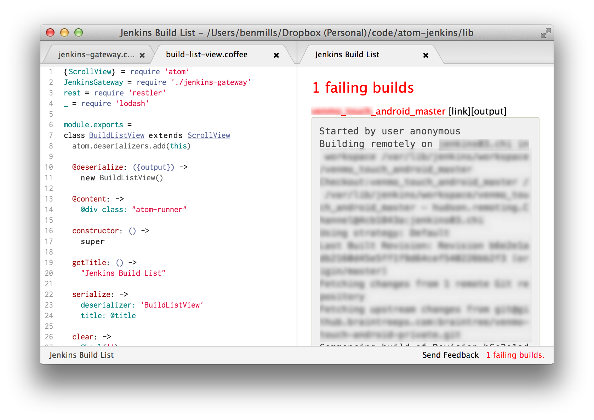

# atom-jenkins

Keep track of your builds inside Atom. You can click on the status bar text or run `jenkins:list` to open a pane that will list all failing builds and allow you to view the build output inside atom.



## Setup

Make sure you set your basic auth username and password as well as the URL Atom will hit to get your `cc.xml` file. Here is an example:

```cson
'jenkins':
  'username': 'my_user'
  'password': 'my_pass'
  'ccxmlUrl': 'https://my.jenkins/cc.xml'
```

## Commands

* `jenkins:toggle` Show a status bar item with the number of failing builds. If you click it a list pane will show.
* `jenkins:list` Show a list of all failing builds which can be clicked to show the current output of the build inside Atom.
